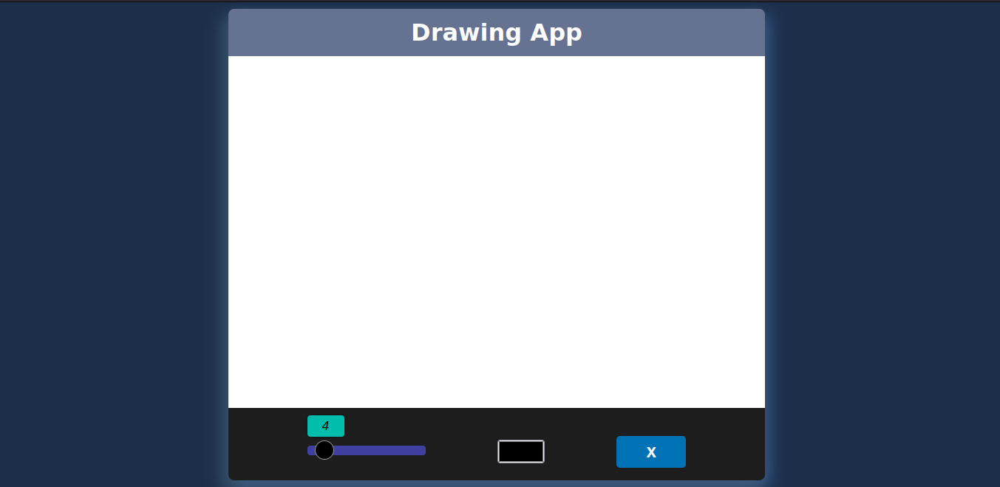
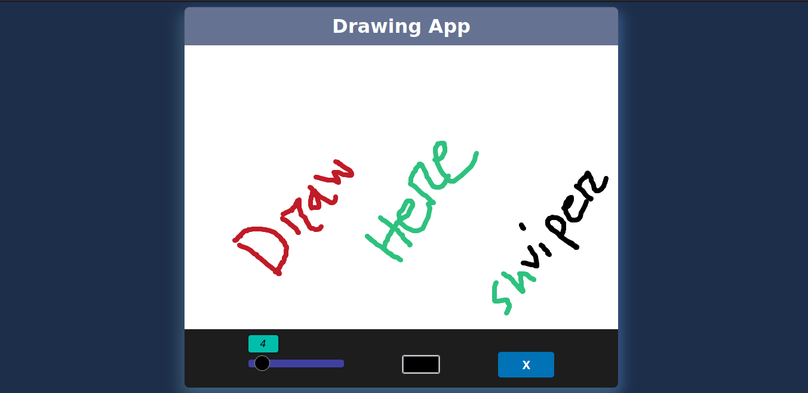

# TODO App

## Table of Contents

- [Table of Contents](#table-of-contents)
- [Introduction](#introduction)
- [Demo](#demo)
- [Screenshot](#screenshot)
- [Built With](#built-with)
- [How To Use](#how-to-use)
- [Clone and Installation](#clone-and-installation)
- [Credit](#credit)
- [Contact](#contact)

## Introduction

### The simple Drawing app .It’s help to draw

## Demo

[](https://shviper.github.io/drawing-app/)

# Screenshot




## Built With

- `HTML`
- `CSS`
- `Javascript`

## How To Use

To clone and run this application, you'll need [Git](https://git-scm.com) installed on your computer. From your command line:

## Clone and Installation

```bash
git clone https://github.com/shviper/drawing-app.git
cd ./drawing-app
```

##### then open `index.html` file

## Credit

[Sajjad Hasan Riyad](https://www.facebook.com/shviper)

## License

[](https://choosealicense.com/licenses/mit/)
## Contact

- ` GitHub` [@shviper](https://www.github.com/shviper)
- `Twitter `[@trshviper](https://www.twitter.com/trshviper)
